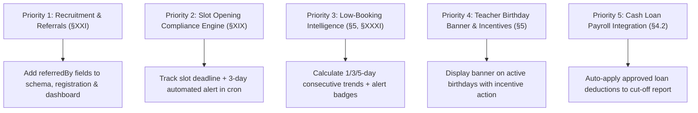

# Netspeak Portal — SRS Requirements Gap Analysis Report

> **Auditor**: Antigravity AI — Architecture & QA  
> **Source Document**: [`docs/System-Requirement-Specification.pdf`](file:///c:/Users/Admin/Desktop/NETSPEAKv2/docs/System-Requirement-Specification.pdf)  
> **Date**: September 29, 2026  
> **Scope**: Full static and runtime code audit of `NETSPEAKv2` against all 33 sections of the consolidated System Requirement Specification (SRS).

---

## Executive Summary

The **Netspeak Portal v2.0** codebase has implemented the foundational operational modules:
- Multi-role custom session authentication & RBAC ([`src/lib/auth/rbac.ts`](file:///c:/Users/Admin/Desktop/NETSPEAKv2/src/lib/auth/rbac.ts))
- Teacher registration, profile directory, and multi-tier approval workflow
- Webcam Freshness Check arrival verification with Supabase Storage integration
- Shift scheduling (PHT), early login lockdown (T-30), late calculation (T-0), and logout restriction (T-15)
- Daily slot output reporting with mandatory policy acknowledgement
- Switch Rest Day (SRD) with attendance schedule sync and Early Time-Off (ETO) with 30-min auto-approval
- Staff operations desk, daily checklists with logout lockout, and simulation drills
- Teacher resignation lifecycle, exit interview scheduling, and IT clearance
- Multi-branch administration, system settings, and consolidated cut-off reports

However, a strict section-by-section audit against [`System-Requirement-Specification.pdf`](file:///c:/Users/Admin/Desktop/NETSPEAKv2/docs/System-Requirement-Specification.pdf) reveals that several requirements are **fully ignored (missing)** or **partially implemented (incomplete)**.

---

## 1. Requirements Fully Ignored / Not Yet Implemented (❌)

These requirements are explicitly mandated by the SRS but have **no corresponding models, actions, or UI surfaces** in the current codebase:

| SRS Ref | Feature / Requirement | SRS Specification Details | Gap in Current Codebase |
| :--- | :--- | :--- | :--- |
| **§XXI (p. 17)** | **Teacher Referral Monitoring** | During registration, applicants must be asked: *"Were you referred by a current teacher?"* If YES, the referring teacher's name must be entered. The portal must track applicant name, referring teacher, application date, hiring status, start date, referral status, and referral fee status. If not entered during application, the referring teacher forfeits the referral fee claim. | ❌ **Completely missing.** Neither `TeacherProfile` nor `TeacherRegistrationForm.tsx` has referral fields. There is no referral management tab in `/dashboard/teachers` or `/dashboard/management`. |
| **§XIX (p. 16)** | **Slot Opening Compliance & Reminders** | Teachers must open slots 1 month in advance. The system must monitor compliance, send an automated reminder **3 days before the deadline**, show which teachers have/have not opened slots, display the deadline date, and report compliance status. | ❌ **Completely missing.** No slot opening tracking model, deadline tracker, compliance status check, or reminder notification in `scheduledJobs.ts`. |
| **§5 (p. 3) & §XXXI (p. 24)** | **Low-Booking Intelligence Tab** | Automated intelligence dashboard flagging:  • **Daily Low Booking**: previous day output below target $\rightarrow$ flags admin to request TPCAP profile upgrade. • **3-Day Low Booking**: under-booking for 3 consecutive days $\rightarrow$ marked *URGENT* for manager intervention. • **5-Day Low Booking**: under-booking for 5 consecutive days $\rightarrow$ marked *CRITICAL* for immediate corrective action. | ❌ **Completely missing.** While `DailyOutput` tracks open vs. booked slots, there is no multi-day trend calculation, no consecutive low-booking evaluator, and no low-booking intelligence tab in management. |
| **§5 (p. 3)** | **Teacher Birthday Notification Banner & Incentives** | Company-wide banner displayed across the portal on teacher birthdays, featuring direct-action buttons for Managers/Officers to assign incentives (**Cash Voucher** / **In-Kind Token**). | ❌ **Completely missing.** `birthday` is collected in `TeacherProfile`, but there is no birthday recognition banner, no celebration feed, and no incentive allocation action. |
| **§XVI (p. 15)** | **Teacher Social Media Monitoring** | *"Teacher Login $\rightarrow$ Social Media Monitoring Starts"*. The system must monitor teacher social media activity during their active login/logout shift window. | ❌ **Completely missing.** No monitoring agent, browser extension hook, or network proxy integration exists to track social media usage during active shifts. |
| **§5 (p. 3)** | **Lesson Fee Automation Sync** | Automated data synchronization scheduled **3 days after each cutoff** (18th and 3rd/4th) to automatically ingest and reconcile 51Talk lesson fees without manual data entry. | ❌ **Completely missing.** The cut-off report computes slot counts and penalties, but no external API connector or automated lesson fee scraping/sync exists. |
| **§VI & §XXV (p. 8, 19)** | **Admin & IT Task Monitoring Desk** | Daily, weekly, and monthly consolidated task desk tracking: completed vs. pending tasks, teacher concerns handled, attendance monitored, resignations processed, SRDs processed, and incident reports investigated. | ❌ **Missing.** Checklists track daily operational items, but there is no overarching Admin/IT task productivity desk tracking operational tickets/tasks completed vs. pending over time. |
| **§XXVII (p. 20)** | **Daily Operations Summary Push to OM Melmar & OM Prei** | System must compile an automated daily attendance summary (Present, Late, Early Out, Absent, SRD, No Login, No Logout, Incomplete Checklist) for Admin and IT staff, and automatically notify Operations Managers (*OM Melmar* and *OM Prei*). | ❌ **Missing.** Alert cron flags individual teacher no-logout instances, but does not compile or broadcast this consolidated operational summary to Operations Managers. |

---

## 2. Requirements Incomplete / Partially Implemented (⚠️)

These requirements have initial implementations or UI components, but remain **incomplete** against specific business rules:

| SRS Ref | Feature | Current Implementation | Missing / Incomplete Specification Rule |
| :--- | :--- | :--- | :--- |
| **§1.4 & §41** | **Automated Credential & Notification Email Delivery** | `src/lib/email.ts` exists; credentials are created on admin approval and printed to server logs. | ⚠️ **Email delivery is not operational.** Verification emails, password reset tokens, and automated email alerts to teachers and operations managers are not active end-to-end. |
| **§2 (p. 2) & §3.3** | **Kiosk Terminal Lockdown & Windows Shutdown** | Web guard restricts early/late access; `scripts/workstation-local-guard.ps1` configures registry lockouts. | ⚠️ **Physical OS Shutdown Dependency:** For center terminals not running the local background agent, automated Windows shutdown (`shutdown.exe`) cannot be executed by standard web browser clients upon shift logout. |
| **§IX (p. 10)** | **Exit Interview Slot Automation** | Exit interview slot booking model and UI exist in `src/actions/resignation.ts`. | ⚠️ **Automated monthly opening & reminders:** The SRS specifies that slots must open automatically every 1st of the month, and automated reminder alerts must be dispatched to the teacher on the day of their interview. Currently, slot creation is manual. |
| **§4.2 (p. 2) & §8.2** | **Cash Loan Amortization & Payroll Integration** | `CashLoanRequest` model, submission form, and manager review workflow are implemented in `src/actions/requests.ts`. | ⚠️ **Deduction Schedule & Cut-Off Link:** The SRS specifies an automatic schedule-of-deductions and due-date reminders. Approved loan amortizations are not yet automatically deducted from net earnings in the semi-monthly `getCutOffReportAction`. |
| **§XVIII (p. 16)** | **Workstation Release & TPCAP Automation on Resignation/AWOL** | Completing IT clearance marks the seat `PENDING_REFORMAT` and unassigns the teacher. | ⚠️ **TPCAP List Automation:** The SRS requires automatically notifying TPCAP and removing the resigned/AWOL teacher from active TPCAP rosters upon resignation. |
| **§XXV (p. 19)** | **IT Weekly & Monthly Checklist Enforcement** | IT daily checklist strictly blocks logout. Weekly and monthly task definitions exist in `checklists.ts`. | ⚠️ **No submission desk or compliance tracking:** Unlike the daily checklist, weekly and monthly checklists do not have a dedicated submission schedule, compliance ledger, or verification history. |

---

## 3. High-Priority Remediation Plan

To achieve 100% compliance with `System-Requirement-Specification.pdf`, the following development priorities are recommended:

### Action Items:

1. **Teacher Referral Tracking (§XXI)**:
   - Extend `TeacherProfile` with `referredByTeacherId` / `referringTeacherName` and `referralFeeStatus` (`PENDING`, `ELIGIBLE`, `PAID`, `FORFEITED`).
   - Update `TeacherRegistrationForm.tsx` to include the required referral prompt.
   - Add a Referral Monitoring view in `/dashboard/teachers`.

2. **Slot Opening Reminder & Compliance Engine (§XIX)**:
   - Add `SlotOpeningCompliance` record tracking monthly target dates.
   - Extend `runScheduledAlertsEvaluationAction` to check 30-day advance slot submissions and dispatch alerts at `T-3 days`.

3. **Low-Booking Intelligence Dashboard (§5, §XXXI)**:
   - Create an intelligence engine scanning `DailyOutput` records over rolling 1-day, 3-day, and 5-day windows.
   - Add Low-Booking KPI indicators to the Management Dashboard with recommended actions (TPCAP upgrade / manager intervention).

4. **Birthday Banner & Manager Incentive Action (§5)**:
   - Add a date-matching query for today's teacher birthdays in the root dashboard layout.
   - Create a celebratory banner modal with quick-action buttons for managers to award Cash Vouchers or In-Kind Tokens.

5. **Cash Loan Payroll Amortization (§4.2)**:
   - Update `getCutOffReportAction` in `src/actions/reports.ts` to query active `CashLoanRequest` records and subtract the per-cutoff amortization amount from payroll balances.
